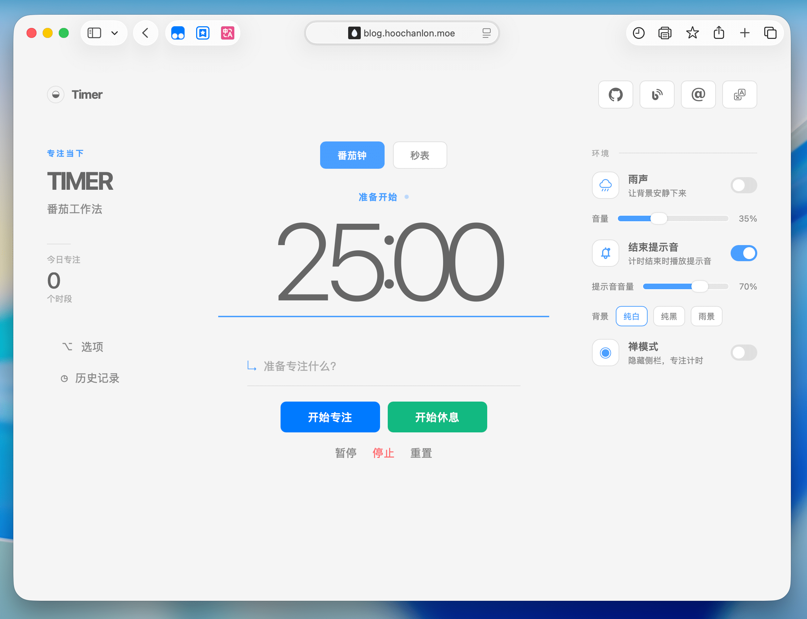
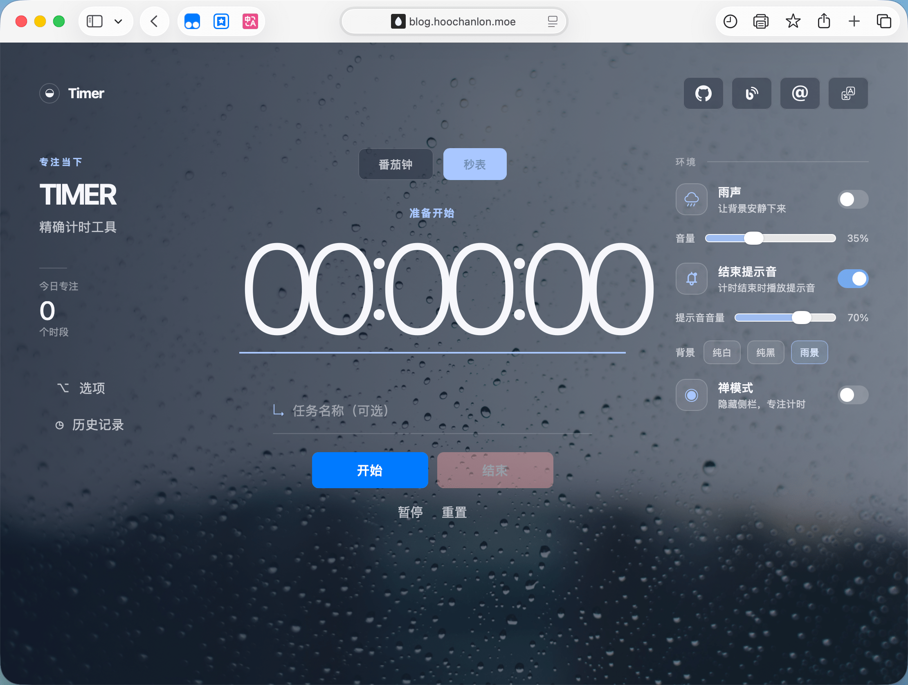

# Shigure 時雨

<div align="center">



集中力を高めるためのミニマルでエレガントなポモドーロタイマーとストップウォッチ。

[ライブデモ](https://hoochanlon.github.io/timer)

**言語:** [中文](./README.md) | [English](./README.en.md) | 日本語

</div>

## ✨ 特徴

- **デュアルタイミングモード** - ポモドーロタイマーとストップウォッチを自由に切り替え
- **没入型体験** - 3つの美しいテーマ（ライト/ダーク/レイン）と環境音
- **禅モード** - サイドバーを非表示にして集中力を最大化
- **スマート履歴** - フォーカスセッションを自動追跡・保存
- **多言語対応** - 中国語、英語、日本語をサポート
- **ゼロ設定** - シングルファイルデプロイ、すぐに使用可能

## 🎯 利点

- **ネイティブスタック** - 純粋なHTML/CSS/JavaScript、フレームワーク依存なし
- **軽量** - ビルド不要、高速ロード
- **プライバシー優先** - localStorageストレージ、データはローカルに保存
- **レスポンシブデザイン** - デスクトップとモバイルで完璧に動作
- **プログレッシブエンハンスメント** - PWA対応、アプリとしてインストール可能

## 🚀 クイックスタート

ES Modulesは HTTP 経由で提供する必要があります：

```bash
pnpm dlx serve
```

または任意の静的サーバーで `index.html` を開きます。

## 📸 スクリーンショット



## 📄 ライセンス

MIT License - Copyright © 2026 [Hoochanlon](https://github.com/hoochanlon)
